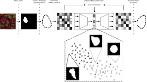

> [!WARNING]
> We have now developed ShapeEmbedLite, a lighter and more performant version of ShapeEmbed. You can find it [here](https://github.com/uhlmanngroup/ShapeEmbedLite). 

<br />

# ShapeEmbed
ShapeEmbed is a self-supervised representation learning framework designed to encode the contour of objects in 2D images, represented as a Euclidean distance matrix, into a shape descriptor that is invariant to translation, scaling, rotation, reflection, and point indexing.

If you use ShapeEmbed in your work, please cite it as follows: 
> Foix-Romero, A., Russell, C., Krull, A., and Uhlmann, V., 2025. ShapeEmbed: a self-supervised learning framework for 2D contour quantification. NeurIPS. [Paper](https://openreview.net/forum?id=iT2ZisemFs).

<p align="center">
<picture>
  <source media="(prefers-color-scheme: dark)" srcset=".imgs/se_latent_viz.dark.svg">
  
</picture>
</p>

<br />

## Getting started
_tested with python 3.12_

Create a virtual environment and install the dependencies as follows:
```sh
python3 -m venv .venv --prompt ShapeEmbed
source .venv/bin/activate
python3 -m pip install --upgrade pip
python3 -m pip install --requirement requirements.txt
```

`source .venv/bin/activate` enters the python virtual environment while a simple `deactivate` from within the virtual environment exits it.

<br />

## Data preparation
To run ShapeEmbed, you first need to extract the 2D contour of the objects you are interested in analyzing, and then to convert these contours into Euclidean distance matrices (EDMs). Follow the method provided [over here](https://github.com/uhlmanngroup/ConvertBinaryMasksToDMs) to turn your binary segmentation masks into EDMs.

<br />

## Run the model

From within the created python environment, run the following:
```sh
python3 shapeembed.py --train-test-dataset <run_name> <distance_matrix_train_dataset> <distance_matrix_test_dataset>  -r 0.0001 -b 1e-12 -e 400 --latent-space-size 128 --indexation-invariant-loss --reflection-invariant-loss --distance-matrix-loss-diagonal 1e-06 --distance-matrix-loss-symmetry 1e-06 --distance-matrix-loss-non-negative 1e-06 --circular-padding --classify-with-scale --preprocess-normalize fro --no-preprocess-augment --pre-plot-rescale 100.0 --no-skip-training --number-random-samples 10
```
> [!TIP]
> Running `python3 shapeembed.py --help` will give a usage message listing hyperparameters that can be set for the run as desired:
> ```sh
> $ python3 shape_embed.py --help
> usage: shape_embed.py [-h]
>                       (--dataset DATASET_NAME DATASET_PATH | --train-test-dataset DATASET_NAME DATASET_TRAIN_PATH DATASET_TEST_PATH)
>                       [-o OUTPUT_DIR] [-d DEV] [-w WEIGTHS_PATH]
>                       [--skip-training | --no-skip-training]
>                       [--report-only TEST_LATENT_SPACE_NPY TEST_LABELS_NPY] [-r LR]
>                       [-p [['[FACTOR]', '[PATIENCE]'] ...]]
>                       [--indexation-invariant-loss | --no-indexation-invariant-loss]
>                       [--reflection-invariant-loss | --no-reflection-invariant-loss]
>                       [--distance-matrix-loss-diagonal [ALPHA_DIAG]]
>                       [--distance-matrix-loss-symmetry [ALPHA_SYM]]
>                       [--distance-matrix-loss-non-negative [ALPHA_NONNEG]] [-e N_EPOCHS]
>                       [-n N_SPLITS_CLASSIFY] [-l LS_SZ] [-b BETA] [-t TB_LOG_DIR]
>                       [--circular-padding | --no-circular-padding]
>                       [--classify-with-scale | --no-classify-with-scale]
>                       [--preprocess-normalize NORM] [--preprocess-rescale SCALAR]
>                       [--preprocess-augment | --no-preprocess-augment]
>                       [--number-random-samples N_RND_SMLPS]
>                       [--pre-plot-rescale PLOT_RESCALE] [-s RPT_SUMMARY]
> 
> run ShapeEmbed
> 
> options:
>   -h, --help            show this help message and exit
>   --dataset DATASET_NAME DATASET_PATH
>                         dataset to use
>   --train-test-dataset DATASET_NAME DATASET_TRAIN_PATH DATASET_TEST_PATH
>                         dataset name and path to train and test sets
>   -o OUTPUT_DIR, --output-dir OUTPUT_DIR
>                         path to use for output produced by the run
>   -d DEV, --device DEV  torch device to use ('cuda' or 'cpu')
>   -w WEIGTHS_PATH, --model-weights WEIGTHS_PATH
>                         Path to weights to load the model with
>   --skip-training, --no-skip-training
>                         skip/do not skip training phase
>   --report-only TEST_LATENT_SPACE_NPY TEST_LABELS_NPY
>                         skip to the reporting based on provided latent space and labels
>                         (no training, no testing)
>   -r LR, --learning-rate LR
>                         learning rate (default=0.001)
>   -p [['[FACTOR]', '[PATIENCE]'] ...], --reduce-lr-on-plateau [['[FACTOR]', '[PATIENCE]'] ...]
>                         dynamically reduce learning rate on plateau (see https://pytorch
>                         .org/docs/stable/generated/torch.optim.lr_scheduler.ReduceLROnPl
>                         ateau.html#torch.optim.lr_scheduler.ReduceLROnPlateau)
>   --indexation-invariant-loss, --no-indexation-invariant-loss
>                         enable/disable use of indexation invariant loss as
>                         reconstruction loss
>   --reflection-invariant-loss, --no-reflection-invariant-loss
>                         enable/disable use of reflection invariant loss as
>                         reconstruction loss
>   --distance-matrix-loss-diagonal [ALPHA_DIAG]
>                         enable diagonal loss in distance matrix loss with optional alpha
>                         (0.0001 if not provided) (disabled by default)
>   --distance-matrix-loss-symmetry [ALPHA_SYM]
>                         enable symmetry loss in distance matrix loss with optional alpha
>                         (0.0001 if not provided) (disabled by default)
>   --distance-matrix-loss-non-negative [ALPHA_NONNEG]
>                         enable non-negative loss in distance matrix loss with optional
>                         alpha (0.0001 if not provided) (disabled by default)
>   -e N_EPOCHS, --number-epochs N_EPOCHS
>                         desired number of epochs (default=100)
>   -n N_SPLITS_CLASSIFY, --number-splits-classify N_SPLITS_CLASSIFY
>                         desired number of splits for classification
>   -l LS_SZ, --latent-space-size LS_SZ
>                         desired latent space size (default=128)
>   -b BETA, --beta BETA  beta parameter, scaling KL loss (default=0.0)
>   -t TB_LOG_DIR, --tensorboard-log-dir TB_LOG_DIR
>                         tensorboard log directory (default='./runs')
>   --circular-padding, --no-circular-padding
>                         enable/disable circular padding in the encoder
>   --classify-with-scale, --no-classify-with-scale
>                         enable/disable scale preservation in classification
>   --preprocess-normalize NORM
>                         enable normalization preprocessing layer, one of ['max', 'fro']
>                         (default None)
>   --preprocess-rescale SCALAR
>                         rescale (post-normalize if enabled) the input by SCALAR (default
>                         None)
>   --preprocess-augment, --no-preprocess-augment
>                         enable/disable augmentation preprocessing layer
>   --number-random-samples N_RND_SMLPS
>                         number of random samples to generate and plot
>   --pre-plot-rescale PLOT_RESCALE
>                         optional scaling factor for result contour plotting
>   -s RPT_SUMMARY, --report-summary RPT_SUMMARY
>                         desired number of report summary lines
> ```

<br />
